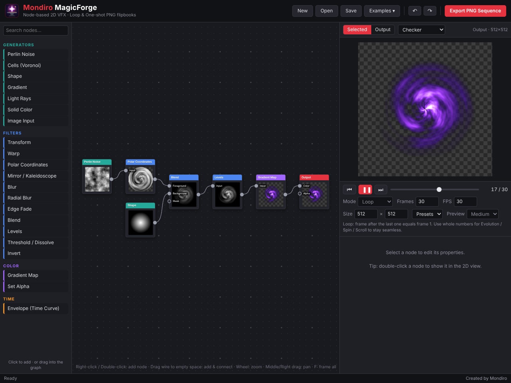
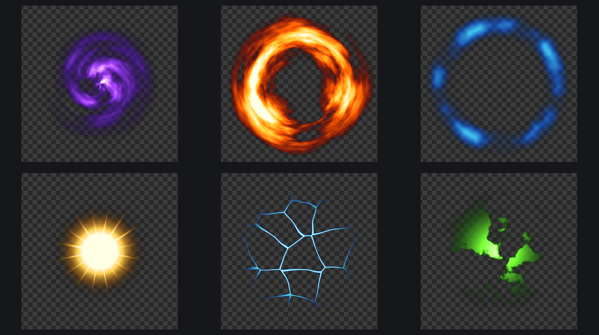

# Mondiro MagicForge

Ứng dụng desktop Windows để tạo **VFX 2D bằng node** (giống Substance Designer). Kết quả xuất ra là **PNG sequence (flipbook)**, chạy được ở hai chế độ **Loop** (lặp liền mạch) và **One-shot** (chạy một lần).

## Chạy app
- **Bản build sẵn:** giải nén `MondiroMagicForge-x.y.z-win-x64.zip` rồi chạy `Mondiro MagicForge.exe`, không cần cài đặt.
- **Từ source:** cài [Node.js](https://nodejs.org), rồi chạy `npm install` và `npm start`.
- **Tự build bản Windows:** chạy `npm run pack:win`, kết quả nằm trong thư mục `dist/`.

## Cách dùng nhanh
1. Kéo node từ thư viện bên trái, hoặc **chuột phải / double-click / Tab** trong graph để thêm node.
2. Kéo dây từ chấm **output** (bên phải node) vào chấm **input** (bên trái node). Kéo dây ra chỗ trống thì app mở menu để thêm node mới và tự nối luôn.
3. Chọn node để chỉnh thông số ở panel bên phải. **Double-click** vào node để xem node đó trong khung 2D.
4. Chỉnh **Mode** (Loop / One-shot), **Frames**, **FPS** và **Size** (mặc định 512×512, gõ được size tự do).
5. Bấm **Export PNG Sequence**, chọn thư mục. File được đặt tên `prefix_0000.png`, `prefix_0001.png`…

### Mẹo để loop mượt
Ở chế độ Loop, các thông số có chữ **"/ clip"** (Evolution, Spin, Scroll, Twinkle, Pulses) là **số nguyên vòng trên cả clip**, nên frame cuối luôn nối khít về frame đầu, dù clip dài 15, 30 hay 60 frame.

### One-shot
- **Transform → Animate Start → End**: scale, xoay, dịch từ giá trị đầu sang giá trị cuối, có ease.
- **Envelope (Time Curve)**: tạo đường cong fade in/out để nhân (Blend: Multiply) vào hiệu ứng.
- **Threshold / Dissolve → Animate Level**: hiệu ứng tan biến.

## Danh sách node
| Nhóm | Node |
|---|---|
| Generators | Perlin Noise, Cells (Voronoi), Shape, Gradient, Light Rays, Solid Color, Image Input |
| Filters | Transform, Warp, Polar Coordinates, Mirror / Kaleidoscope, Blur, Radial Blur, Edge Fade, Blend, Levels, Threshold / Dissolve, Invert |
| Color | Gradient Map (có preset Fire, Magic, Ice, Electric, Poison…), Set Alpha |
| Time | Envelope (Time Curve) |
| Output | Output (alpha từ màu, từ độ sáng, hoặc bake nền đen cho Additive) |

## Phím tắt
`Ctrl+S` lưu · `Ctrl+O` mở · `Ctrl+N` tạo mới · `Ctrl+E` export · `Ctrl+Z / Ctrl+Y` undo / redo · `Ctrl+D` nhân bản node · `Delete` xoá node · `Space` play/pause · `← →` lùi/tiến từng frame · `F` xem toàn bộ graph · `Tab` thêm node

---
Created by Mondiro
